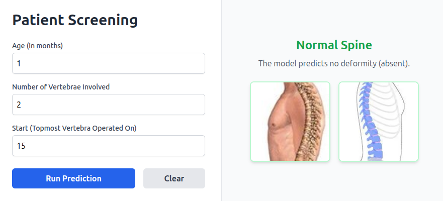
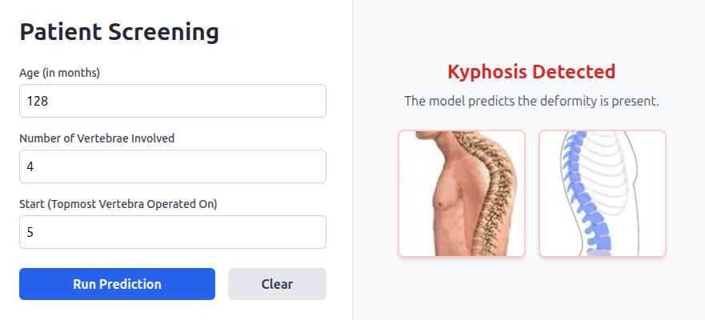

# 🩺 Kyphosis Disease Prediction AI

## 📌 Project Overview
Kyphosis Disease Prediction AI is a clinical decision support tool designed to quickly screen patients for Kyphosis (a spinal deformity). By inputting three basic clinical metrics-the patient's age, the number of vertebrae involved, and the starting vertebra-the application instantly predicts whether the disease is present. Built with Python and Flask, the underlying SVM model is uniquely optimized for medical safety, prioritizing high Recall to ensure positive cases are successfully caught.

---

### 🧪 Medical Comparison
| Normal Spine | Kyphotic Deformity |
| :---: | :---: |
|  |  |

---

## 🖥️ Dashboard UI
The application provides a real-time interface for screening.

| Case: No Kyphosis Detected | Case: Kyphosis Detected |
| :--- | :--- |
|  |  |

---

## 📊 Model Performance
* **Recall (Sensitivity):** 75% — *Optimized to ensure 3 out of 4 positive cases are caught.*
* **Accuracy:** 76% 
* **Model Type:** Support Vector Machine (RBF Kernel)
* **Scaling:** StandardScaler (Z-score normalization)

---

## 🛠️ Repository Structure
- `app.py`: Flask backend and prediction API.
- `kyphosis_svm_model.pkl`: Pre-trained SVM "Brain".
- `kyphosis_scaler.pkl`: Input "Translator".
- `kyphosis.ipynb`: Full EDA, Data Cleaning, and Model Training history.
- `requirements.txt`: List of dependencies for deployment.

---

## 🚀 How to Run Locally

## Prerequisites
Before you begin, ensure you have the following installed:
* **Git:** To clone the repository.
* **Docker (Recommended):** For running the application in an isolated, 100% reproducible environment.

---

1. **Clone the repository:**
   ```bash
   git clone https://github.com/MalindaBotheju/Kyphosis-Disease-Prediction.git
   ```
   ```bash
   cd Kyphosis-Disease-Prediction

2. **Build the Docker image:**
   ```bash
   docker build -t kyphosis-app .

3. **Run the container:**
   ```bash
   docker run -p 5000:5000 kyphosis-app

4. **Open in your browser:**
   Go to http://127.0.0.1:5000/ to use the dashboard.
